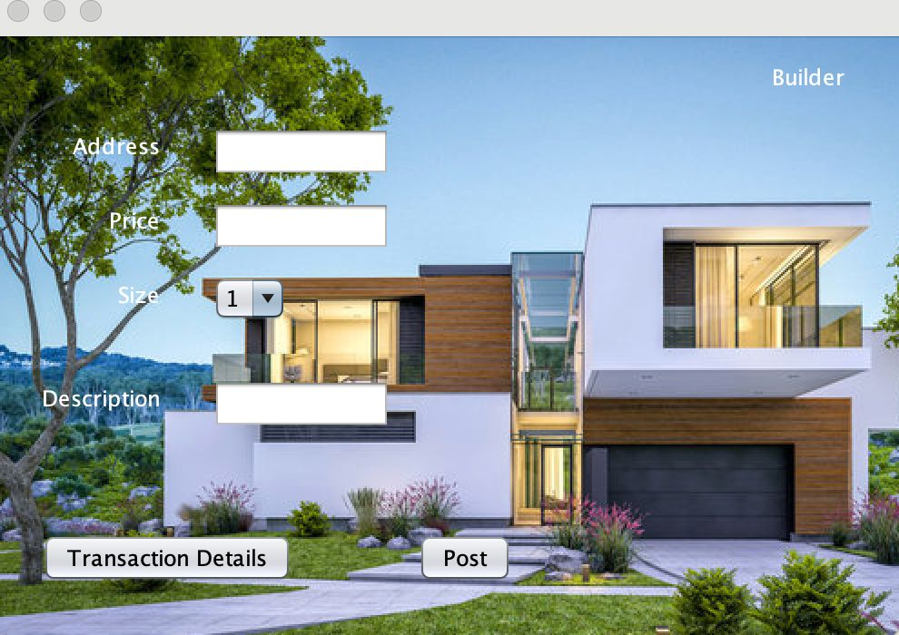

# 🏠 Real Estate Management System (REMS)

A DBMS mini-project built using **Java**, **MySQL**, and **Apache NetBeans**, designed to manage and streamline real estate operations including property listings, user management, realtor/agent data, builder information, and property transactions.


---

## 📌 Table of Contents

* [Overview](#overview)
* [Tech Stack](#tech-stack)
* [Database Schema](#database-schema)
* [Entity Tables](#entity-tables)
* [Features & Tasks](#features--tasks)
* [Screenshots](#screenshots)
* [Future Enhancements](#future-enhancements)

---

## 📋 Overview

The Real Estate Management System enables:

* User registration and login
* Secure password recovery via email OTP
* Property listing and filtering
* Agent/builder account management
* Viewing and storing transaction history

---

## 🛠️ Tech Stack

| Component       | Technology      |
| --------------- | --------------- |
| Frontend        | Java (Swing)    |
| Backend         | Java, JDBC      |
| Database        | MySQL           |
| IDE             | Apache NetBeans |
| Email Service   | JavaMail API    |
| Version Control | Git             |

---

## 🗂️ Database Schema

### ER Diagram

* Five major entities: `UserDetails`, `PropertyDetails`, `RealtorAgentDetails`, `BuilderDetails`, `TransactionDetails`


<p align="center">
  
  <br>
  <em>ER Diagram</em>
</p>


### Relational Schema (Table Relations)

```sql
UserDetails(UserID, Username, Email, Password, UserType)
PropertyDetails(PropertyID, Address, Price, Size, Description, UserID → UserDetails)
RealtorAgentDetails(AgentID, Name, ContactInfo, UserID → UserDetails)
BuilderDetails(BuilderID, Name, ContactInfo, UserID → UserDetails)
TransactionDetails(TransactionID, PropertyID → PropertyDetails, AgentID → RealtorAgentDetails, BuyerID, SellerID → UserDetails)
```


<p align="center">
  
  <br>
  <em>Relational Schema</em>
</p>
---

## 🧾 Entity Tables

### `UserDetails`

```sql
CREATE TABLE UserDetails (
  UserID INT PRIMARY KEY,
  Username VARCHAR(50),
  Email VARCHAR(100),
  Password VARCHAR(50),
  UserType VARCHAR(20)
);
```

### `PropertyDetails`

```sql
CREATE TABLE PropertyDetails (
  PropertyID INT PRIMARY KEY,
  Address VARCHAR(255),
  Price DECIMAL(18, 2),
  Size DECIMAL(10, 2),
  Description TEXT,
  UserID INT,
  FOREIGN KEY (UserID) REFERENCES UserDetails(UserID)
);
```

### `RealtorAgentDetails`

```sql
CREATE TABLE RealtorAgentDetails (
  AgentID INT PRIMARY KEY,
  Name VARCHAR(100),
  ContactInfo VARCHAR(100),
  UserID INT,
  FOREIGN KEY (UserID) REFERENCES UserDetails(UserID)
);
```

### `BuilderDetails`

```sql
CREATE TABLE BuilderDetails (
  BuilderID INT PRIMARY KEY,
  Name VARCHAR(100),
  ContactInfo VARCHAR(100),
  UserID INT,
  FOREIGN KEY (UserID) REFERENCES UserDetails(UserID)
);
```

### `TransactionDetails`

```sql
CREATE TABLE TransactionDetails (
  TransactionID INT PRIMARY KEY,
  PropertyID INT,
  AgentID INT,
  BuyerID INT,
  SellerID INT,
  TransactionDate DATE,
  Price DECIMAL(18, 2),
  FOREIGN KEY (PropertyID) REFERENCES PropertyDetails(PropertyID),
  FOREIGN KEY (AgentID) REFERENCES RealtorAgentDetails(AgentID),
  FOREIGN KEY (BuyerID) REFERENCES UserDetails(UserID),
  FOREIGN KEY (SellerID) REFERENCES UserDetails(UserID)
);
```

---

## ✅ Features & Tasks

### 🔐 User Login

```java
String query = "SELECT userid, password FROM userdetails WHERE username = ? AND password = ?";
```

### 👤 Create User

```java
String query = "INSERT INTO userdetails VALUES (?, ?, ?, ?, ?)";
```

### 🔁 Forgot Password with OTP

```java
String query = "SELECT COUNT(*) FROM userdetails WHERE email = ?";
```

### 🔑 Update Password

```java
String query = "UPDATE userdetails SET password = ? WHERE email = ?";
```

### 🏡 Post Property

```java
String query = "INSERT INTO propertydetails VALUES (?, ?, ?, ?, ?, ?)";
```

### 🔎 Search Property

```java
String query = "SELECT * FROM propertydetails WHERE address = ? AND price < ? AND size = ?";
```

### 💵 Buy Property (Insert Transaction)

```java
String query = "INSERT INTO transactiondetails VALUES (?, ?, ?, ?, ?, ?)";
```

### 📋 Show Transactions

```java
String query = "SELECT * FROM transactiondetails WHERE BuyerID = ? OR SellerID = ?";
```

---

## 🖼️ Screenshots

| Feature           | Image Filename        | Preview                                        |
| ----------------- | --------------------- | ---------------------------------------------- |
| Login Page        | `login.jpeg`          |                     |
| Dashboard Page    | `dashboard.jpeg`      |             |
| Create New User   | `createnewuser.jpeg`  |       |
| Update Password   | `updatepassword.jpeg` |  |
| Property Search   | `search.jpeg`         |          |
| Transactions Page | `transactions.jpeg`   |       |


